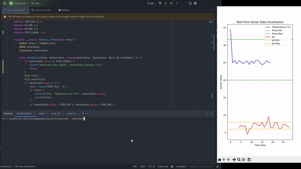

# Sistema de Monitoreo de Sensores

Este sistema simula el monitoreo de parámetros ambientales como la temperatura y el pH, utilizando hilos y comunicación interprocesos en C. El sistema está compuesto por un programa sensor que envía datos a un monitor a través de un pipe nombrado.

## Componentes

- `main_monitorTest.c`: Contiene la lógica del monitor que recibe y procesa los datos.
- `main_sensor.c`: Simula los sensores enviando datos al monitor.

## Descripción de los Componentes

### main_monitorTest.c
El monitor maneja la recepción de datos de los sensores. Utiliza múltiples hilos para procesar los datos de temperatura y pH almacenados en buffers separados.

### main_sensor.c
El sensor envía datos simulados de temperatura o pH al monitor a través de un pipe. Puede ser configurado para enviar datos a diferentes intervalos.


## Compilación y Ejecución

### Compilación

Utiliza el siguiente comando para compilar el monitor y el sensor. Asegúrate de estar en el directorio que contiene los archivos fuente.

```bash
make all
```

## Ejecucion
1. Ejecutar el monitor primero para asegurar que el pipe está disponible:
```bash
./Monitor -b [tam_buffer] -t [file_temp] -h [file_ph] -p [pipe_nominal]
```
-b [tam_buffer]: Este argumento especifica el tamaño del buffer que se usará para almacenar temporalmente las mediciones antes de procesarlas. Un buffer es necesario para manejar las variaciones en la tasa de llegada de datos y para asegurar que el sistema pueda manejar ráfagas de datos entrantes sin perder información.

-t [file_temp]: Indica el nombre del archivo donde se guardarán las mediciones de temperatura. Este archivo es utilizado por el hilo de manejo de la temperatura para registrar todas las mediciones válidas que se reciben, lo cual es crucial para la auditoría y análisis posterior.

-h [file_ph]: Similar al archivo de temperatura, este es el nombre del archivo donde se guardarán las mediciones de pH. Permite que el sistema mantenga un registro detallado de todas las mediciones de pH para su análisis posterior.

-p [pipe_nominal]: Especifica el nombre del pipe nominal que se utiliza para la comunicación entre los sensores y el monitor. Los pipes nominales son una forma de IPC (Inter-process Communication) que permite a los procesos independientes compartir datos de manera eficiente.

2. Ejecutar el sensor
./monitorTest
```bash
./Sensor -s [tipo_sensor] -t [tiempo] -f [archivo] -p [pipe_nominal]
```
-s [tipo_sensor]: Este argumento define el tipo de sensor que se está simulando. Por ejemplo, -s 1 podría indicar un sensor de temperatura, mientras que -s 2 podría indicar un sensor de pH. Esto permite que el mismo ejecutable del sensor se use para simular diferentes tipos de sensores simplemente cambiando este parámetro.

-t [tiempo]: Define el intervalo de tiempo en segundos entre cada envío de datos del sensor al monitor. Este parámetro es crucial para controlar la frecuencia de muestreo y transmisión de datos, afectando directamente la carga del sistema y la resolución temporal de las mediciones.

-f [archivo]: Especifica el nombre del archivo del que el sensor leerá las mediciones. Este archivo debe contener los datos que el sensor "simula" como si estuvieran siendo medidos en tiempo real, permitiendo una fácil adaptación del sistema para probar diferentes conjuntos de datos.

-p [pipe_nominal]: Al igual que en el comando del monitor, este argumento indica el nombre del pipe que el sensor utilizará para enviar datos al monitor. Es esencial que este nombre coincida con el especificado en el monitor para que la comunicación entre los procesos funcione correctamente.

## Notas Adicionales

- **Inicio del Monitor**: Es crucial que el monitor esté corriendo antes de iniciar los sensores para evitar errores de "pipe no encontrado".
- **Argumentos Necesarios**: Asegúrate de proporcionar todos los argumentos necesarios al ejecutar el sensor para evitar errores de ejecución. Esto incluye especificar correctamente el tipo de sensor, el intervalo entre mediciones, el archivo de datos de donde se leen las mediciones, y el nombre del pipe.

## Problemas Comunes

- **Pipe no encontrado**: Este error ocurre si intentas iniciar los sensores antes de que el monitor esté activo. Asegúrate de que el monitor esté ejecutando antes de iniciar cualquier sensor para establecer el pipe necesario para la comunicación.
- **Datos no recibidos**: Si los datos no están siendo correctamente recibidos por el monitor, verifica que los nombres de los pipes y los archivos de datos sean consistentes y correctos en ambos programas. Además, asegúrate de que el formato y la integridad de los datos en los archivos de datos cumplan con lo esperado por el programa sensor.

# Compilacion y Ejecucion en Windows
# Proyecto de Monitoreo de Sensores

Este proyecto muestra el funcionamiento de un sistema de monitoreo de sensores en tiempo real.

## Vista previa

## Demostración en Video

[](https://youtu.be/cIl5wHBAFZE)

Haga clic en la imagen de arriba para ver el video completo en YouTube.

## Funcionalidades

- Monitoreo de temperatura y pH.
- Alerta en tiempo real cuando los valores están fuera de los límites establecidos.
- Visualización en tiempo real de los datos del sensor.

## Instrucciones de Uso

1. Clona el repositorio.
2. Compila y ejecuta el monitor.
3. Compila y ejecuta los sensores.
4. Ejecuta el script de visualización en Python.

```sh
# Clonar el repositorio
git clone https://github.com/tu_usuario/tu_repositorio.git
cd tu_repositorio

# Compilar y ejecutar el monitor
gcc -o monitorW.exe main_monitorW.c -lws2_32
./monitorW.exe

# Compilar y ejecutar el sensor
gcc -o SensorW.exe main_sensorW.c -lws2_32
./SensorW.exe -s 1 -t 1 -p \\.\pipe\MyPipe

# Ejecutar el script de visualización
python read.py

